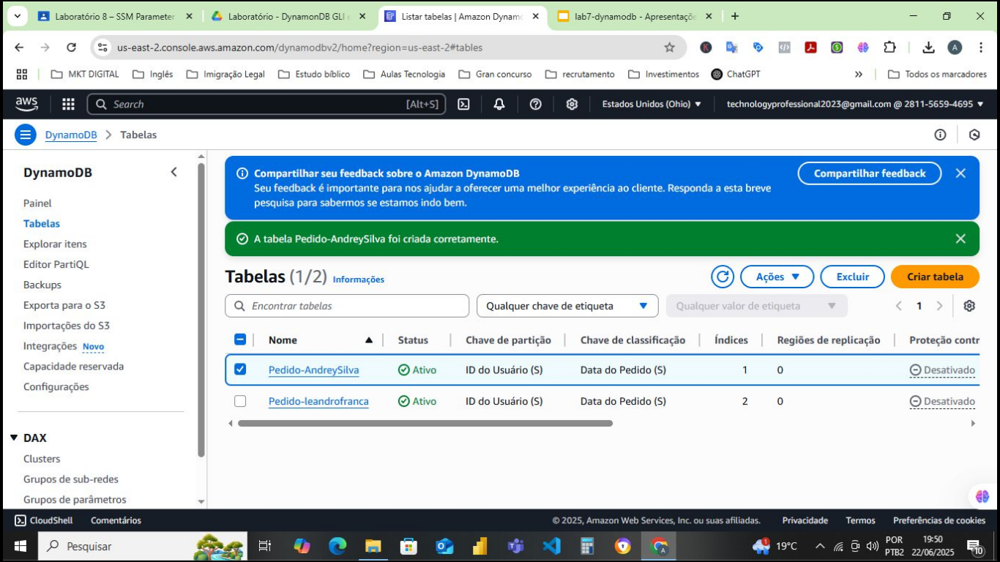
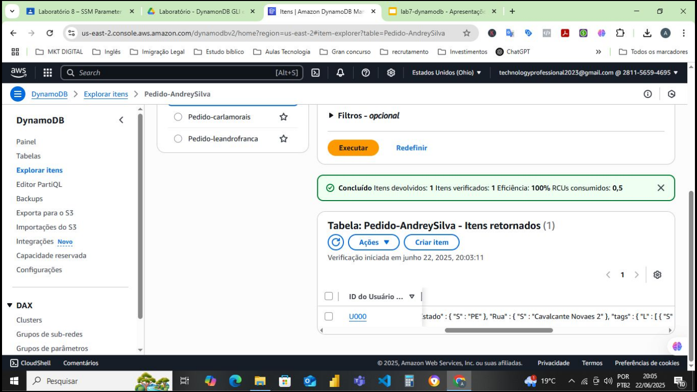
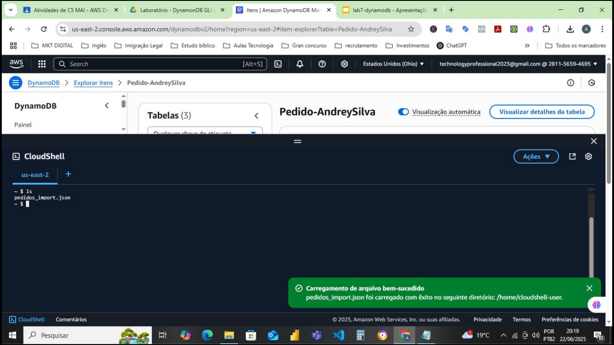
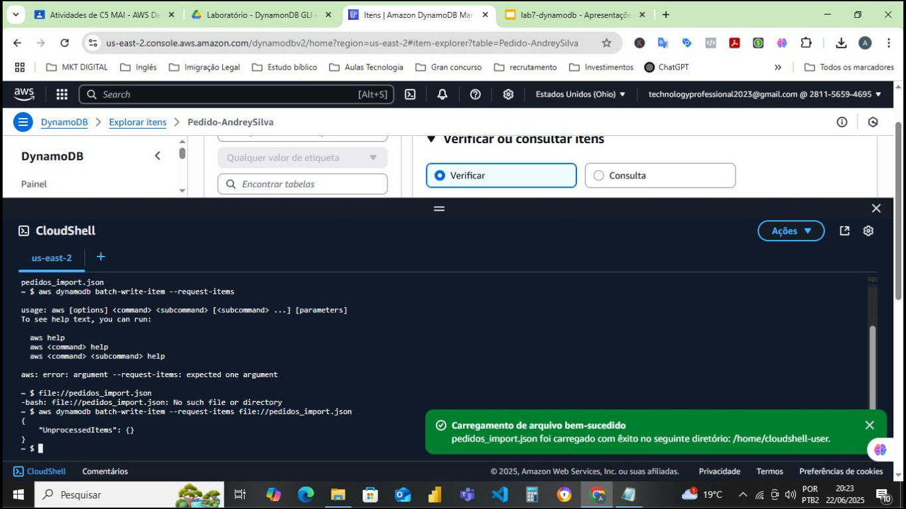
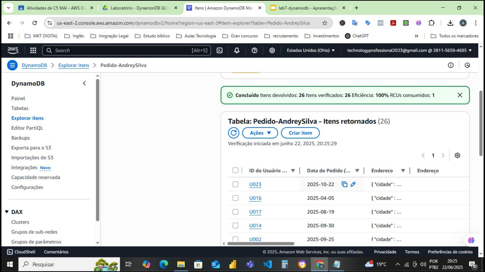
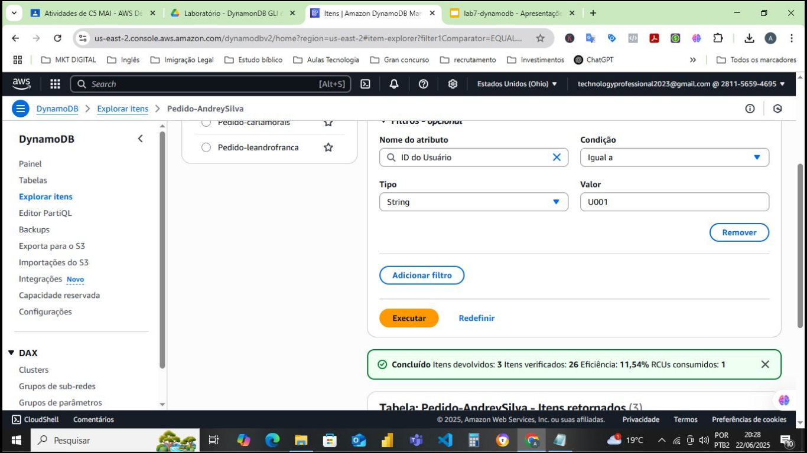
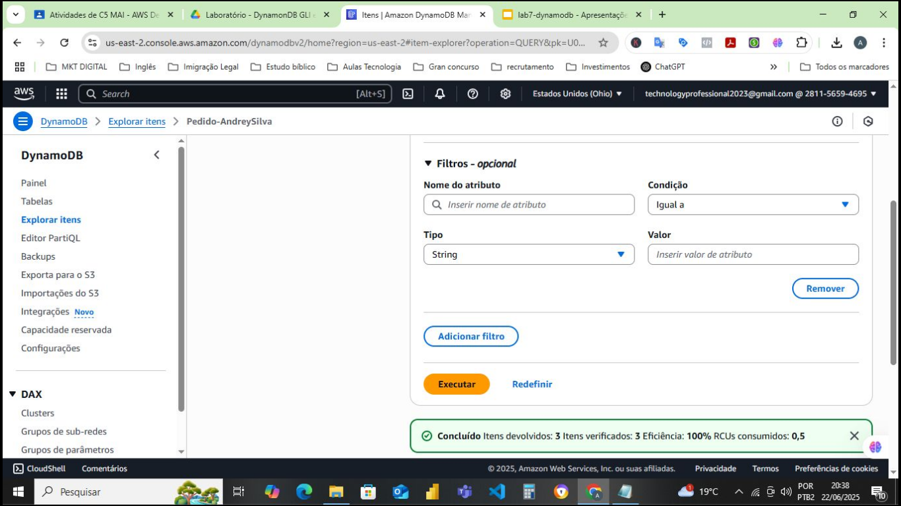
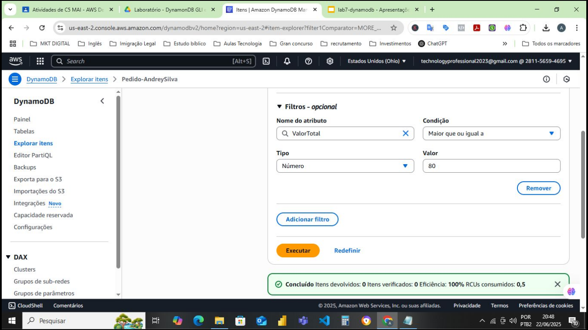
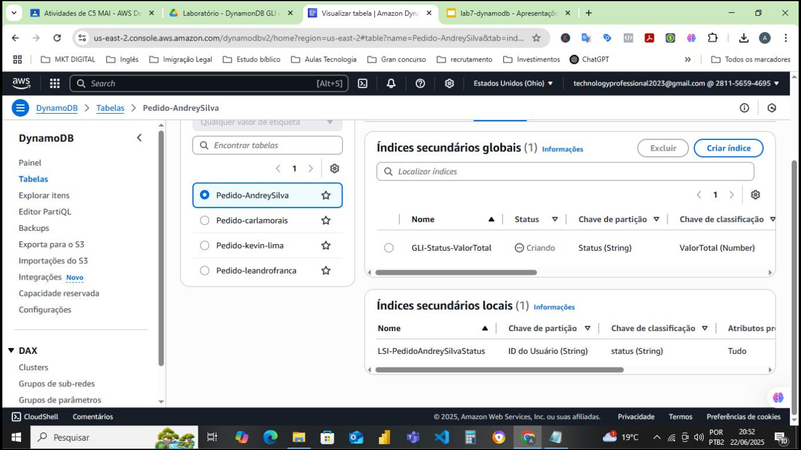
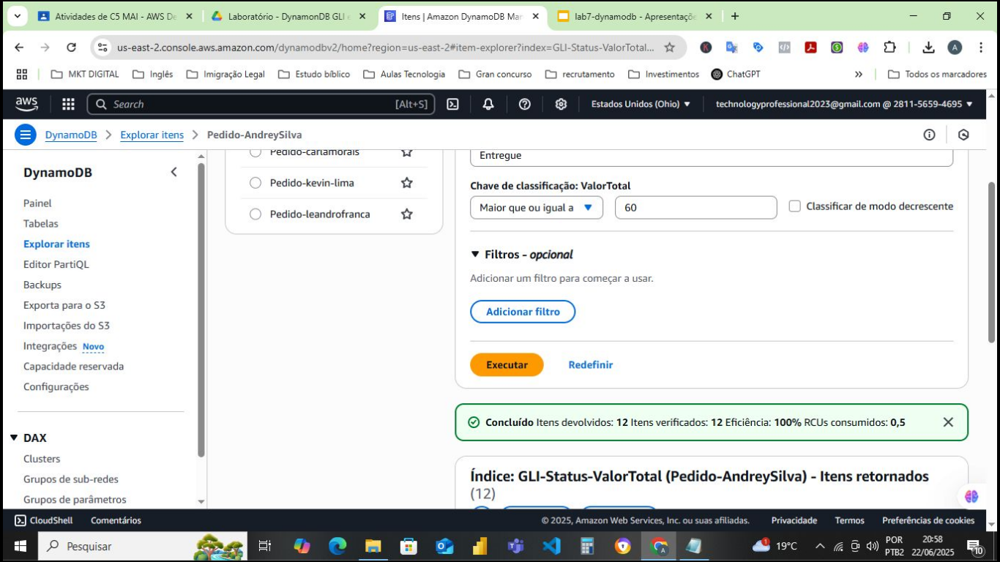

# Banco-de-Dados-DynamoDB-com-GSI-e-LSI
Criação de Banco de Dados DynamoDB com índices globais e locais, operações de inserções e consultas tanto pelo Console quanto pelo CloudShell da AWS.

# 📊 Criação de Banco de Dados DynamoDB com Índices Globais GLI e Secundários SLI

## 📌 Descrição
Neste Projeto, foi criado uma tabela no DynamoDB com índices
secundários locais (LSI) e globais (GLI), além de realizar operações de inserção e consulta
utilizando tanto o console da AWS quanto no terminal CloudShell.
---
## 🚀 Tecnologias Utilizadas
- **Cloud:** Console AWS e CloudShall
- **Banco de Dados:** DynamoDB  
- **Outras:** Arquivos Json  
---
## 🎯 Objetivos do Projeto

- ✅ Criar uma tabela no DynamoDB com chave de partição e chave de ordenação.
- ✅ Adicionar um índice secundário local (LSI) e um índice secundário global (GLI).
- ✅ Popular a tabela com dados de forma manual e automatizada (via CloudShell).
- ✅ Realizar buscas utilizando diferentes métodos e analisar a eficiência.
- ✅ Entender como os índices impactam a performance de leitura.
- ✅ Aprender a excluir índices e tabelas após uso.  

---
## Cenário
Fui contratado por uma empresa fictícia que precisa armazenar pedidos realizados por
clientes em uma base NoSQL. Minha missão é construir uma tabela chamada Pedido-
Andrey no DynamoDB que possibilite consultas eficientes tanto por ID de usuário e data
do pedido quanto por status e valor total do pedido. Para isso, serão utilizados índices
secundários locais e globais.

---
## 📂 Estrutura do Projeto
📁 nome-do-projeto

├── 📄 README.md <- Documentação do projeto

├── 📄 requirements.txt <- Dependências do Python

├── 📄 main.py <- Script principal

├── 📁 notebooks/ <- Jupyter Notebooks de exploração

└── 📁 src/ <- Código-fonte organizado

---

## 📊 Resultados

**1. Criando o Banco de Dados**

---
**2. Criando Tabela**

---
**3. Inserção de dados na tabela via CloudShall**

---

---
**4. Tabela com Dados Inseridos**

---
**5. Pesquisa de dados na tabela pelo ID, Condição, Tipo, Valor. A quantidade de valores retornados**

---

---

**6. Configurações que melhoraram a eficiencia da pesquisa e da performance do Banco de Dados**

---

**7. Índices Globais e Secundários Configurados**

---

**8. Pesquisa Realizada Utilizando valores retorna a eficiência, desempenho e RCUs consumidos**

---
## 📎 Links Importantes
- 🔗 **Portfólio:** [https://seuusuario.github.io/portfolio](https://seuusuario.github.io/portfolio)  
- 🔗 **LinkedIn:** https://www.linkedin.com/in/techprofessional-AndreySilva/ 
- 🔗 **GitHub:** https://github.com/Andrey-Silva-Data
---

## 📜 Licença
© 2025 Andrey Silva - Todos os direitos reservados.
